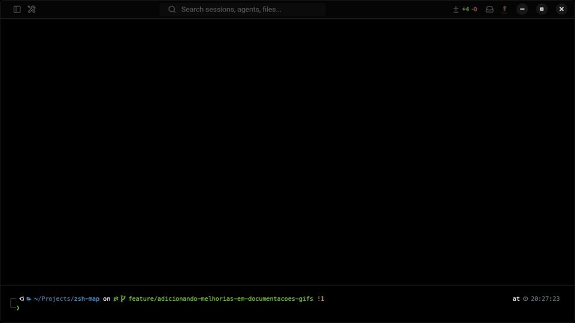
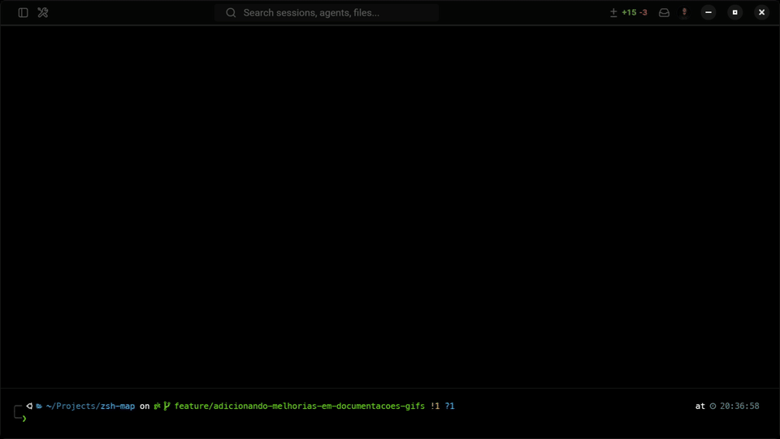
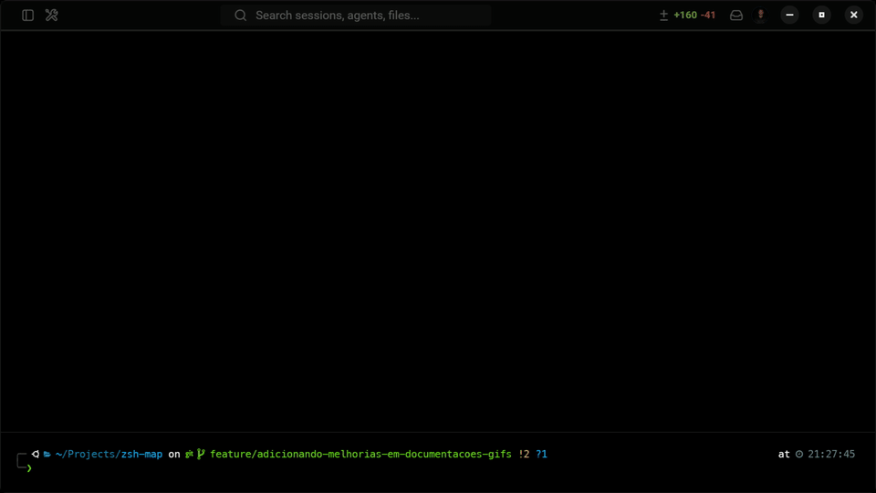

# ZshMap

Ferramenta com menu **Whiptail** que lê **`zshmap.yml`** na raiz de cada projeto e **`~/.zshmap.yml`** na home, gera **`~/.zprofile-auto`** e integra extras Zsh, Git, instalação opcional de programas (pastas configuradas em lista) e mais.

Repositório: **`zsh-map`** (clone típico `~/Projects/zsh-map`).

## ✨ Novidades

**Interface no terminal com Whiptail**

O ZshMap oferece:
- Menus e confirmações no terminal
- Barras de progresso em operações longas
- Navegação por teclado
- **Fluxos em etapas:** telas Whiptail encadeadas guiam a escolha do projeto, do atalho e das confirmações, para não teres de decorar comandos longos no dia a dia.

## 🚀 Como usar

### Permissões

```bash
chmod +x zsh-map.sh
chmod +x install_whiptail.sh
```

### Instalação das dependências
```bash
./install_whiptail.sh
```

### Teste rápido do Whiptail (opcional)
O **`test_whiptail.sh`** na raiz abre uma `msgbox` e um `menu` mínimos — não usa `~/.zshmap.yml`.

```bash
./test_whiptail.sh
```

### Execução principal
```bash
./zsh-map.sh
```

Verificação do funcionamento básico das funcionalidades:


## Configuração global

1. **Recomendado:** no menu, **Configurar ~/.zshmap.yml (start)**. O script cria `~/.zshmap.yml` a partir de `.zshmap.home.example.yml` (no mesmo diretório que `zsh-map.sh`) se ainda não existir; mostra Git (nome, email, editor) e abre o ficheiro no editor.

   Alternativa manual:
```bash
touch ~/.zshmap.yml
```

2. Exemplo de `~/.zshmap.yml`:
```yaml
projects:
  dir: "~/Projects"
  ignore_dirs:
    - "project-1"
    - "project-2"

install:
  programs_dir:
    - "~/Projects/substitui-pelo-repo/programs"
    - "~/Projects/substitui-pelo-repo/outros-programs"

shell:
  extras_source:
    - "~/Projects/substitui-pelo-repo/.zshmap-extras.zsh"
```

Ou você já pode iniciar essas configurações pela interface:



Se o arquivo ainda não existir, ele criará para você.

3. **Extras Zsh:** ficheiros `.zsh` listados em `shell.extras_source` (lista).

4. No ZshMap: **Gerar .zprofile-auto**. Abre um terminal novo ou `source ~/.zprofile-auto`.

## Exemplo de `zshmap.yml` na raiz do projeto

Cada repositório sob `projects.dir` pode ter um **`zshmap.yml`** na raiz com **`project`** e a lista **`shortcuts`**. Cada atalho define pelo menos **`name`**, **`type`**, **`path`** (relativo à raiz do repo) e **`command`** ou a lista **`commands`**. Depois de gerares o `.zprofile-auto` e carregares no shell, chamas pelo **nome** do atalho (o script gera **funções Zsh** com esse nome).

```yaml
project:
  name: "Meu projeto"
  shortcuts:
    - name: up
      title: "Subir stack (Docker)"
      type: test
      path: "."
      command: docker compose up -d

    - name: test
      title: "Testes Artisan"
      type: test
      path: "."
      command: php artisan test
```

**Nota:** `type: test` cobre comandos “normais” no fluxo do script. Existem tipos especiais (`helper`, `parameterized`, `dump`, `interactive-test`) — vê a lógica em `zsh-map.sh` para casos avançados.

## Funcionalidades

### Instalação de programas
- `install.programs_dir` é **sempre uma lista** em `~/.zshmap.yml`; requer **yq**. O menu só aparece se alguma pasta listada existir e tiver `.sh`.

Deixamos assim para que nossos usuários organize e crie seus scripts da maneira e versionamento que acharem melhor, apenas indicando o diretório dos scripts.

Demonstração:



### Integração de atalhos com Projetos

Coloca um ficheiro **`zshmap.yml`** na **raiz** de cada repositório que esteja dentro de `projects.dir` em `~/.zshmap.yml`.

A estrutura de topo é **`project:`** (metadados do repo) e a lista **`shortcuts:`**. Cada entrada de `shortcuts` descreve um atalho que aparece no menu do ZshMap e, após **Gerar .zprofile-auto**, vira uma **função Zsh** com o mesmo **`name`** (os nomes têm de ser **únicos entre todos os projetos**; duplicados bloqueiam a geração).

#### Campos usuais de um atalho

| Campo | Função |
|--------|--------|
| `name` | Identificador do atalho (comando/função no shell). |
| `title` | Título amigável no Whiptail (opcional). |
| `path` | Diretório **relativo à raiz do projeto** onde o shell faz `cd` antes de correr os comandos (ex.: `"."`). |
| `type` | Etiqueta do fluxo: `docker`, `code`, `test`, … Alguns valores têm tratamento dedicado no script; o resto segue o fluxo genérico de `command` / `commands`. |
| `command` | Uma única linha de shell. |
| `commands` | Várias linhas, executadas em sequência. |
| `setup_shortcut` | Nome de **outro** atalho deste mesmo `zshmap.yml` a executar antes (preparação). |
| `show_output` | `true` ou `false`: controla se a saída dos comandos é mostrada ou silenciada em parte dos fluxos. |

#### Comandos e Docker Compose

Para subir stacks, reiniciar serviços ou correr `docker compose` / `docker exec`, usa **`commands`** (lista) ou **`command`** (uma linha). O valor de `type` pode ser por exemplo `docker` — o importante é a **sequência de comandos** no diretório `path`.

```yaml
project:
  name: "meu-backend"
  shortcuts:
    - name: "subir-stack"
      path: "."
      commands:
        - "echo 'A iniciar containers...'"
        - "docker compose up -d"
        - "echo 'Stack no ar.'"
      type: "docker"
      show_output: false
```

#### Atalho `type: parameterized`

- Define **`command_template`** com placeholders `{{nome_do_parametro}}`.
- Lista **`parameters`**: cada item tem `name`, **`type: input`** ou **`type: yesno`**, `prompt`, `required`, e opcionalmente `validation` (regex), `error_message`, `placeholder`, `default`.
- **`input`:** caixa de texto Whiptail; com `placeholder`, o texto de ajuda aparece no corpo do diálogo.
- **`yesno`:** pergunta Sim/Não; `default: true` ou `false` altera o botão pré-selecionado.

#### Parâmetros em fluxos `dump` (e afins)

Para atalhos que usam o fluxo de **dump** / recolha dinâmica, o script usa outra função de recolha: o **`prompt`** pode ser **string** ou **lista de strings** (várias linhas no texto mostrado). No texto podes usar **`$bases_path`**, expandido a partir de `project.dump_config.bases_path`.

Tipos de parâmetro suportados nesse fluxo incluem:

- **`input`** — texto livre, com validação opcional por regex.
- **`selection`** com **`source: tenants`** — checklist Whiptail com pastas sob `dump_config.bases_path` que contenham ficheiros `*.sql.zip`.

Outros `type` de parâmetro caem num **fallback** para caixa de texto.

#### Atalho `type: interactive-test` (assistente em etapas)

É um assistente guiado por **Whiptail** que pergunta opções, mostra um **relatório** com os comandos exatos e, no fim, executa testes dentro do container da aplicação (`docker exec` usando **`project.docker.containers.app`**).

No mesmo atalho, define um bloco **`test_config`** (além de `title`, `path`, `show_output`, etc.). Campos úteis:

- **`recreate_environment`** — indica se o fluxo pode oferecer recriar o ambiente (a resposta real vem das perguntas).
- **`test_commands`** — lista de comandos base sugeridos (o utilizador pode escolher variantes no wizard).
- **`questions`** — lista ordenada. Cada pergunta tem:
  - **`id`** — identificador lógico. O script mapeia alguns ids aos dados do comando final: por exemplo **`recreate_env`** e **`no_coverage`** (Sim/Não), **`testsuite`** e **`filter`** (texto), e **`test_command`** quando usas menu para escolher o binário.
  - **`type: yesno`** — lista Sim/Não com textos `title` e `message`; `default` aceita valores como `true` / `false` / `yes` / `no` / `0` / `1`.
  - **`type: menu`** — menu de opções: `message`, texto extra opcional **`option_text`**, e **`options`** com **`label`** + **`command`** (ou uma string simples por opção).
  - **`type: input`** — caixa de texto com `message` e `default`.

Antes de correr testes, o assistente precisa de saber **como montar a linha de comando** a partir das respostas. Isso define-se em **`project.test_config.command_line`** ou, só para esse atalho, em **`test_config.command_line`** dentro do próprio shortcut (sobrescreve o do projeto). Inclui chaves como `include_testsuite`, `testsuite_flag`, `include_filter_if_non_empty`, `filter_flag`, `include_no_coverage_when_sim`, `no_coverage_flag`, `no_coverage_answer_value` e `color_append_rules` (lista `contains` / `append`).

Se o utilizador escolher **recriar o ambiente**, define **`project.test_config.setup_shortcut`** com o **`name`** do atalho que faz migrations / reset (o script executa essa cadeia antes dos testes).

Para integrar o menu antigo **«teste»** do projeto com este assistente, podes definir **`project.test_config.interactive_test_shortcut`** com o `name` de um shortcut `interactive-test`.

Exemplo mínimo de `questions` dentro de um atalho `interactive-test` (adaptável ao teu projeto):

```yaml
shortcuts:
  - name: "meus-testes"
    title: "Testes interativos"
    path: "."
    type: "interactive-test"
    show_output: true
    test_config:
      recreate_environment: true
      test_commands:
        - "vendor/bin/phpunit"
        - "php artisan test"
      questions:
        - id: "recreate_env"
          type: "yesno"
          title: "Configuração de testes"
          message: "Refazer o ambiente antes de correr os testes?"
          default: true
        - id: "test_command"
          type: "menu"
          title: "Configuração de testes"
          message: "Comando de teste:"
          option_text: "Escolhe a ferramenta (texto extra acima do menu)."
          options:
            - label: "PHPUnit"
              command: "vendor/bin/phpunit --testdox"
            - label: "Artisan"
              command: "php artisan test"
        - id: "testsuite"
          type: "input"
          title: "Configuração de testes"
          message: "Testsuite (ex.: Feature):"
          default: "Feature"
        - id: "filter"
          type: "input"
          title: "Configuração de testes"
          message: "Filtro opcional (--filter):"
          default: ""
        - id: "no_coverage"
          type: "yesno"
          title: "Configuração de testes"
          message: "Desativar coverage?"
          default: true
```

Exemplo real de uso:


### Integração nos aliases do ZSH

Depois de **Gerar .zprofile-auto** e correres `source ~/.zprofile-auto` no Zsh, **cada shortcut** definido em `zshmap.yml` fica disponível como **função** com o **mesmo nome** que o campo `name`. Assim podes executar os atalhos **direto no terminal** — por exemplo escrever o nome da função e Enter — **sem abrir** `./zsh-map.sh` nem percorrer o menu principal do ZshMap (o código gerado inclui o `cd` para o `path` do projeto e a sequência de `command` / `commands`).



Para **saltar etapas** e ir logo aos atalhos de **um** projeto, define no `zshmap.yml`, ao nível de **`project`**, a chave **`helper_show_commands`**: é o **nome da função** que queres usar como atalho “helper” desse repo (ex.: `meu-projeto-helper`, `volleytrack-helper`). O ZshMap gera essa função extra, que abre **só o menu Whiptail dos shortcuts daquele projeto** (via `show_project_shortcuts_interface`), sem escolheres antes o projeto no mapa global — maior agilidade quando trabalhas sempre no mesmo código.

```yaml
project:
  name: "meu-backend"
  helper_show_commands: "meu-projeto-helper"
  shortcuts:
    - name: "subir-stack"
      # ...
```

No terminal, após `source ~/.zprofile-auto`: `meu-projeto-helper` (ou o nome que definiste em `helper_show_commands`).

**Nota:** no `.zprofile-auto` gerado, os atalhos YAML são **funções**; o cabeçalho do ficheiro acrescenta também **aliases** fixos (por exemplo para Git), separados dos shortcuts do YAML.

Os atalhos também podem ser chamados diretamente no terminal, depois de executar o comando "🔧 Gerar .zprofile-auto" assim ficando disponíveis como aliases no seu terminal para chamada de execução direta.


### Outros tipos de atalho (resumo)

- **`helper`** — executa cada linha da lista **`commands`** depois de `cd` para `path`.
- **`dump`** / **`interactive-test`** — fluxos longos com Whiptail e Docker; vê `zsh-map.sh` para detalhes finos.

### Atalhos dinâmicos e integração com o Zsh
- **Criação dinâmica por projeto:** cada repositório pode declarar atalhos no seu `zshmap.yml` (na raiz); o ZshMap descobre projetos a partir de `~/.zshmap.yml` e monta menus e ações em função do que está definido — não precisas de editar o script para cada novo projeto ou comando.
- **Global:** `~/.zshmap.yml` — `projects`, `install`, `shell.extras_source`.
- **Whiptail como “assistente”:** as integrações de telas (menus, listas, caixas de mensagem) encaixam-se no fluxo de execução dos atalhos — escolhes o contexto no menu e segues as etapas até correr o que precisas, com menos erros e menos cópia de comandos.
- **Funções no Zsh:** ao gerares **`~/.zprofile-auto`** e o carregares no teu shell, cada atalho do YAML fica disponível como **função** com o mesmo nome, para invocares na linha de comandos além do menu Whiptail (o ficheiro gerado inclui também **aliases** fixos no cabeçalho, por exemplo para Git).

### Git, Zsh, sistema
- Configuração Git local, dependências Zsh, informações do sistema (conforme opções do menu).


## Licença

MIT.

---

**ZshMap** — YAML, menu e Zsh no mesmo fluxo.
